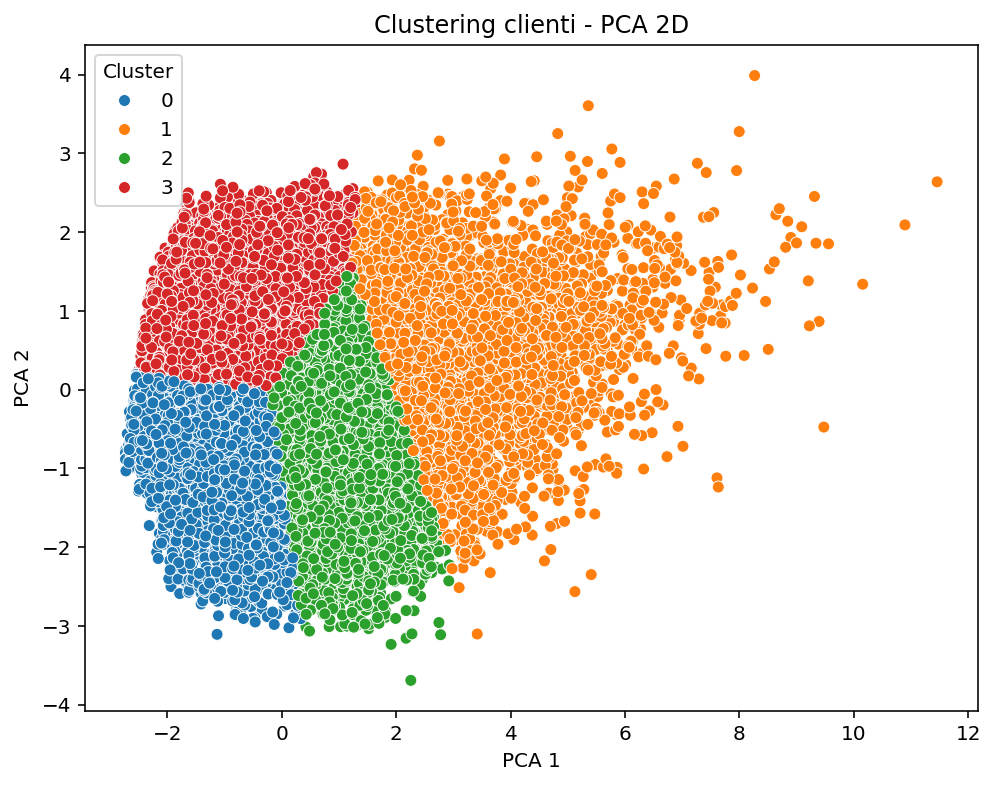

# Clustering of Insurance Customers – Results (PCA + KMeans)

> **Project**: Unsupervised customer segmentation  
> **Goal**: Identify risk profiles and optimize pricing  
> **Dataset**: `data_synthetic.csv` 
> **Method**: PCA 2D + KMeans (4 clusters)  
> **Code**: `clustering_pipeline.py` (with `random_state=42`)

---
## Exploratory Data Analysis (EDA)

The following histograms and scatter plot were generated from the simulated claims data.  
They provide the **raw risk distribution** before clustering and help validate the four customer profiles.

| Plot | Description |
|------|-------------|
|  | **Claim Frequency (`Sim_Frequency`)** – Poisson-like, heavily right-skewed. ~8k k customers have **0 claims**, ~12 k have **1 claim**, ~11 k have **2 claim**  then a rapid drop. A tiny tail reaches **≥ 10 claims**. |
|  | **Expected Loss (`Expected_Loss`)** – Highly skewed, with a sharp peak at **0 €** (most safe drivers) and a long tail up to ~2 000 €. |
|  | **Total Severity (`Sim_Total_Loss`)** – Similar shape to Expected Loss (log-normal behavior). Most policies have **low total payout**; a few extreme cases exceed 2 000 €. |
|  | **Frequency vs Total Severity**, coloured by **Risk Profile (0–3)** – Strong positive correlation (higher frequency → higher total loss). Higher `Risk Profile` values systematically sit on the upper-right part of the cloud, confirming the simulation logic. |

### How the EDA connects to the clusters

| Cluster | Frequency (mean) | Expected Loss (mean) | Interpretation from EDA |
|---------|------------------|----------------------|--------------------------|
| **0 – Gold Safe** | **0.83** | **19.71 €** | Dominates the **left-most bars** (0–1 claims) and the **near-zero loss** region. |
| **1 – High Frequency Loser** | **5.91** | **425 €** | Located in the **far-right tail** of the frequency histogram and the **high-loss tail**. |
| **2 – Balanced Premium** | **2.94** | **147 €** | Middle of the frequency distribution (2–4 claims) with moderate loss. |
| **3 – Claim Heavy, Low Premium** | **2.55** | **47 €** | Surprisingly low loss despite a **high claim history** (3.71) – explains the **under-pricing** (only 1.9 k premium). |

These plots **confirm the clustering**: the four groups naturally separate along the two risk dimensions (frequency & severity) that dominate the PCA projection.


## Key Findings

| Cluster | Name | Risk | Avg. Profit | Action |
|--------|------|------|-------------|--------|
| **0** | **Gold Safe** | Low | **+3,203 €** | Retain |
| **1** | **High Frequency Loser** | Very High | **+3,114 €** (high cost) | Renegotiate / Exclude |
| **2** | **Balanced Premium** | Medium-High | **+3,643 €** | Maintain |
| **3** | **Claim Heavy, Low Premium** | High | **+1,892 €** | **Increase premium** |

> **Key insight**: **Cluster 3** pays only **1.9k** but has **Claim History = 3.71** → **underpriced by 60%+**

---

## PCA 2D Visualization



*(Generated with `random_state=42` – fully reproducible)*

- **X-axis (PCA1)**: Premium, Income, Expected Loss  
- **Y-axis (PCA2)**: Claim frequency, Claim History  
- **Cluster 0 (blue)**: bottom-left → low risk, high value  
- **Cluster 1 (orange)**: top → high cost
- **Cluster 2 (green)**: center → balanced risk
- **Cluster 3 (red)**: center-left → high claims, low premium

---

## Cluster Summary (mean values)

| Cluster | Sim_Freq | Exp_Loss | Premium | Income | Credit | Prev_Claims | Claim_Hist |
|--------|----------|----------|---------|--------|--------|-------------|------------|
| **0**  | 0.83     | 19.71    | 3223    | 84.7k  | 671    | 1.53        | 1.07       |
| **1**  | 5.91     | 425.28   | 3539    | 81.4k  | 671    | 2.23        | 3.84       |
| **2**  | 2.94     | 147.51   | 3790    | 83.4k  | 665    | 2.10        | 2.62       |
| **3**  | 2.55     | 47.91    | 1939    | 80.4k  | 683    | 1.27        | 3.71       |

---

## Customer Profiles – Description

| Cluster | Profile |
|--------|--------|
| **0 – Gold Safe** | Very few claims, high premium, good credit score. **Ideal customer.** |
| **1 – High Frequency Loser** | 5.9 claims/year, expected loss 425€. **Not sustainable.** |
| **2 – Balanced Premium** | 2.9 claims, pays 3.8k → **best margin.** |
| **3 – Claim Heavy** | Claim History very high (3.71), premium only 1.9k → **underpriced!** |

---

## Recommended Actions

| Cluster | Strategy |
|--------|----------|
| **0** | Loyalty discount, upselling (home, life) |
| **1** | Increase premium to **5.5k+** or **do not renew** |
| **2** | Offer telematics → discount for safe driving |
| **3** | **Increase premium to 3.2k+** (mandatory) |

---

## Technical Pipeline

```python
Pipeline([
    ("prep", ColumnTransformer([
        ("num", StandardScaler(), num_features),
        ("cat", OneHotEncoder(drop="first"), cat_features)
    ])),
    ("pca", PCA(n_components=2, random_state=42)),
    ("kmeans", KMeans(n_clusters=4, random_state=42))
])
